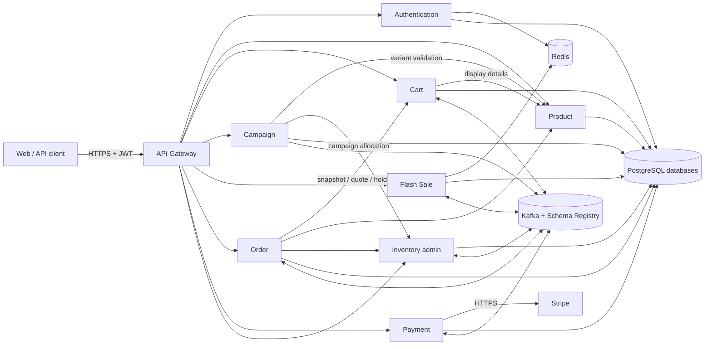

# Flash Sale Platform

A Java 21 / Spring Boot 3.5 microservice system for normal commerce and high-contention flash-sale
checkout. The repository demonstrates more than CRUD: it separates service ownership, uses
transactional outboxes for durable event publication, applies Redis Lua on the seckill hot path,
coordinates payment and stock through Sagas, and delivers reviewed container images to AWS EKS
through GitOps.

> **Current environment status (2026-09-08):** the local implementation and Feature 049 test suite
> are available in this repository. The cost-bearing EKS cluster is currently absent after cleanup, so
> current cloud deployment checks must be treated as pending until the infrastructure is recreated.
> Historical validation evidence remains under `specs/*/validation.md`.

## What the system implements

- shopper registration, login, token refresh, logout, JWKS, and service client credentials;
- public Product catalog plus versioned administrative lifecycle operations;
- a persistent, shopper-owned Cart with Product enrichment and safe reconciliation;
- Campaign preparation, stock allocation, lifecycle events, and recovery;
- atomic Flash Sale admission with Redis Lua, durable acceptance, and reservation expiry;
- authoritative Inventory movements, campaign allocations, and regular-purchase holds;
- Order-owned orchestration for flash-sale and regular-purchase Sagas;
- Stripe Checkout, signed webhooks, receipt deduplication, and payment recovery;
- Kafka Avro contracts, Schema Registry, consumer DLTs, and transactional outboxes;
- Kustomize/Argo CD delivery to EKS and a small Prometheus/Grafana seckill dashboard.

The Maven reactor contains ten Spring Boot applications. Nine form the implemented commerce
topology (Gateway plus eight business services); `notification-service` is a runnable scaffold but
does not yet own a public API or delivery workflow.

## System at a glance



External business traffic enters through API Gateway. Internal HTTP contracts use short-lived
service JWTs, while asynchronous facts and commands use versioned Avro records. A service never
reads another service's database.

## Purchase flows

### Normal Buy Now

```text
Shopper -> Order /buy-now
        -> Product authoritative quote
        -> Inventory atomic five-minute hold
        -> Order + Saga + PaymentRequested outbox
Payment -> Stripe Checkout -> signed webhook -> PaymentSucceeded
Order   -> confirm Inventory hold -> CONFIRMED
```

### Normal Cart checkout

```text
Shopper -> Order /cart-checkouts
        -> immutable Cart snapshot
        -> Product authoritative batch quote
        -> Inventory all-or-nothing hold
        -> one Order + one Payment
success -> confirm hold -> reconcile only unchanged Cart lines
failure -> release/expire hold; no partial Order is accepted
```

Cart prices are display estimates. Product supplies the acceptance price, Inventory owns stock, and
Order/Payment own the final monetary record.

### Flash Sale (seckill)

```text
Admin -> Campaign -> Product validation + Inventory allocation
CampaignScheduled/Activated -> Kafka -> Flash Sale projection
Shopper -> Gateway -> Flash Sale -> Redis Lua atomic quota/idempotency decision
Redis Stream -> PostgreSQL journal/outbox -> PurchaseAccepted
Order -> PaymentRequested -> Payment result
success -> confirm reservation -> Order CONFIRMED
failure/deadline -> release reservation -> Order CANCELLED/EXPIRED
```

Redis is the contention-control mechanism, not the durable source of truth. The Redis Stream handoff
closes the crash gap before Flash Sale persists its journal and outbox to PostgreSQL.

## Architecture rules

- Packages follow pragmatic Clean/Hexagonal Architecture: inbound adapter -> input port/use case ->
  domain -> output port -> outbound adapter.
- PostgreSQL is durable truth; each stateful service owns its schema and Liquibase changesets.
- Required state changes and event publication use a transactional outbox.
- Consumers are idempotent; poison records have bounded retries and owned DLTs.
- Kafka contracts are Avro schema-first and versioned in `contracts/kafka-avro-contracts`.
- Redis Lua is reserved for the atomic Flash Sale hot path.
- API Gateway owns routing, CORS, JWT edge validation, rate limiting, trace propagation, and local
  Swagger aggregation; it owns no business data.
- Database migrations run as explicit one-off processes/Jobs, not concurrently in every replica.

See [architecture documentation](docs/architecture/README.md),
[ADRs](docs/adr/), and the [service map](services/README.md).

## Repository map

| Path | Responsibility |
|---|---|
| [`services/`](services/README.md) | Independently packaged Spring Boot applications |
| [`contracts/`](contracts/README.md) | Versioned cross-service contracts and generated Avro module |
| [`libs/common-web/`](libs/common-web/README.md) | Small shared HTTP envelope library; no business ownership |
| [`infra/`](infra/README.md) | Local Compose, Kubernetes, Terraform, GitOps, and monitoring |
| [`docs/`](docs/README.md) | Architecture, API, operations, testing, and engineering guides |
| [`specs/`](specs/) | Approved Spec Kit requirements, plans, tasks, and validation evidence |
| [`load-tests/`](load-tests/README.md) | Controlled capacity and scenario test assets |

## Technology stack

| Area | Technology |
|---|---|
| Runtime | Java 21, Spring Boot 3.5.16, Spring Cloud 2025.0.3 |
| HTTP | Spring MVC, Spring Cloud Gateway WebFlux, OpenFeign |
| Security | Spring Security, RS256 JWT/JWKS, OAuth2 client credentials |
| Data | PostgreSQL, Spring Data JPA, Liquibase |
| Hot path/cache | Redis and atomic Lua scripts |
| Messaging | Apache Kafka 4, Avro SpecificRecord, Confluent Schema Registry |
| Payments | Stripe Checkout and signed webhook processing |
| Delivery | Docker, ECR, Terraform, EKS, Kustomize, Argo CD, GitHub Actions OIDC |
| Observability | Actuator/Micrometer, Prometheus, Grafana |

## Local quick start

Requirements: Docker Desktop, Java 21, and PowerShell 7 (or equivalent shell commands).

1. Create the ignored runtime configuration and replace every placeholder:

   ```powershell
   Copy-Item infra/docker/.env.example infra/docker/.env
   ```

   Generate/store RSA JWT files outside Git at the directory configured by `AUTH_JWT_KEY_DIR`.
   Never commit `.env`, private keys, Stripe secrets, or database credentials.

2. Validate and start the platform:

   ```powershell
   docker compose --env-file infra/docker/.env -f infra/docker/compose.yml config
   docker compose --env-file infra/docker/.env -f infra/docker/compose.yml up -d `
     postgres redis kafka schema-registry
   ```

3. Apply service-owned migrations, then start the application profile. Follow the exact local
   migration procedure in [`infra/docker/README.md`](infra/docker/README.md); do not delete volumes
   merely to rerun an initialization script.

   ```powershell
   docker compose --env-file infra/docker/.env -f infra/docker/compose.yml --profile apps up -d --build
   ```

4. Verify the edge:

   ```powershell
   Invoke-RestMethod http://localhost:8080/actuator/health/readiness
   ```

The host port is controlled by `GATEWAY_PORT`. The optional `infra/docker/compose.dev.yml` publishes
direct service debug ports.

## Build and test

```powershell
.\mvnw.cmd clean verify
.\mvnw.cmd -pl services/order-service -am verify
pwsh -NoLogo -NoProfile -File .\infra\scripts\docs\verify-api-documentation.ps1
kubectl apply --dry-run=client -k infra/k8s/overlays/cloud
```

Run a focused module during development; run the complete reactor before merging a cross-service
change. Validation evidence belongs in the active feature's `validation.md`, including command,
environment, result, and date.

## HTTP API and Swagger

The current catalog contains **53 supported method/path endpoints**: 42 Gateway-public, 10 internal,
and one JWKS identity-trust endpoint. Start with:

- [HTTP API catalog](docs/api/README.md)
- [Frontend integration guide](docs/api/frontend-integration-guide.md)

Swagger is disabled by default and must remain disabled at the public cloud edge. For local use,
set `API_DOCS_ENABLED=true` in the ignored `infra/docker/.env`, rebuild the apps, and open:

```text
http://localhost:8080/swagger-ui.html
```

## Local and cloud environments

The project deliberately models only two environments:

- **local** — Docker Compose for development and integration testing;
- **cloud** — AWS EKS desired state under `infra/k8s/overlays/cloud`, reconciled by Argo CD.

There is no separate production environment. The historical Product pilot is evidence, not a third
environment. Cloud creation incurs AWS charges; always inspect `terraform plan`, restrict the EKS
public API CIDR, and destroy unused infrastructure deliberately.

The delivery flow is:

```text
source PR -> develop -> GitHub Actions verify/build -> ECR immutable image
          -> generated image-promotion PR -> review/merge -> Argo CD -> EKS
```

GitHub Actions never deploys with `kubectl` and never pushes directly to `develop`. Read
[`infra/terraform/README.md`](infra/terraform/README.md),
[`infra/k8s/README.md`](infra/k8s/README.md), and
[`infra/scripts/gitops/README.md`](infra/scripts/gitops/README.md) before recreating cloud resources.

## Observability and capacity evidence

Every active application exposes liveness, readiness, and Prometheus metrics. The cloud monitoring
baseline scrapes application services and provides a seckill-focused Grafana dashboard; it is
single-replica and intentionally excludes Alertmanager, Slack, Loki, Tempo, and infrastructure
exporters.

Capacity numbers are profile- and environment-specific, not universal claims. The dated Feature 046
evidence recorded a controlled local ramp through 100 RPS, a latency guard breach at 200 RPS, and an
immediate-danger stop during the historical 300 RPS cloud probe. Consult
[`specs/046-seckill-capacity-gate/validation.md`](specs/046-seckill-capacity-gate/validation.md)
before quoting results.

## Suggested reading paths

- **New developer:** this README -> [services](services/README.md) ->
  [local Docker](infra/docker/README.md) -> [API guide](docs/api/README.md).
- **Backend interview:** [architecture](docs/architecture/README.md) -> Flash Sale, Order, Payment,
  and Inventory READMEs -> [Kafka contracts](contracts/kafka-avro-contracts/README.md).
- **Frontend:** [frontend integration guide](docs/api/frontend-integration-guide.md) -> Swagger.
- **Cloud/GitOps:** [infrastructure](infra/README.md) -> Terraform -> Kubernetes -> GitOps scripts.
- **Why a decision exists:** [ADRs](docs/adr/) and the governing feature under `specs/`.

## Known boundaries

- Notification Service is a scaffold; email/SMS/push delivery is not implemented.
- The monitoring stack is an internship-scale baseline, not HA production observability.
- Current EKS live validation is unavailable while the cost-bearing cluster is absent.
- Historical validation proves only the exact commit, environment, and profile recorded alongside
  the result.
