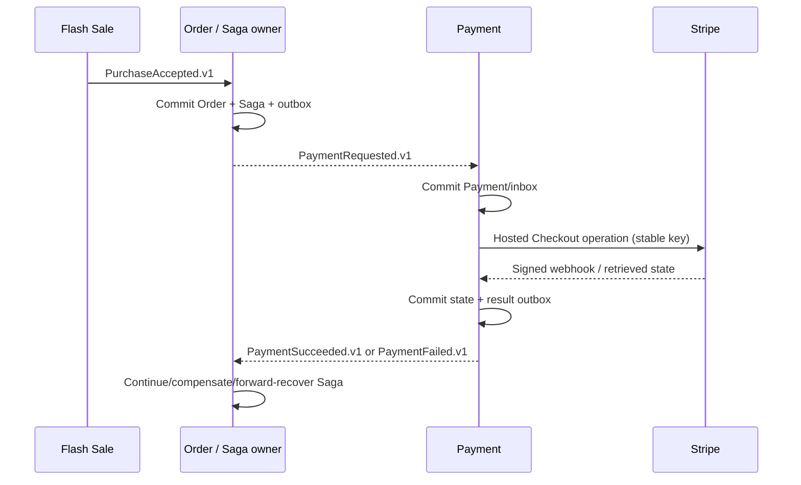

# ADR 0018: Order-Owned Purchase Saga and Payment Contracts

**Status**: Accepted — approved by project owner decisions Q1=A, Q2=A, Q3=A and recorded with
Feature 021 planning on 2026-08-17
**Date**: 2026-08-17
**Owners**: Project owner; Order Service owner; Payment Service owner
**Scope**: Purchase workflow orchestration between Order Service and Payment Service

## Context

Feature 019 durably accepts a flash-sale purchase and publishes `PurchaseAccepted.v1`. Feature 020
creates the Order and publishes `OrderCreated.v1`, while intentionally deferring payment
orchestration. Feature 021 adds Stripe-hosted Checkout and must decide who owns workflow state,
whether Order facts can double as commands, and how late/ambiguous provider outcomes affect the
distributed transaction.

No local database transaction can atomically include Order PostgreSQL, Payment PostgreSQL, Kafka,
Stripe, and reservation state. Stripe can accept a request whose response is lost; webhooks can be
duplicated, delayed, or reordered; and a payment can become visible after the internal deadline.
The ownership and message intent must therefore be explicit before implementation.

## Decision

1. Order Service is the Purchase Saga orchestrator and durable owner of purchase workflow state.
   There is no global Saga coordinator service.
2. Order Service issues `PaymentRequested.v1` on `flashsale.payment.commands.v1`, keyed by
   `orderId`. The command contains immutable order/user/amount/currency/payment-deadline data.
3. `OrderCreated.v1` remains a committed fact. Payment Service must not consume or reinterpret it as
   implicit authorization to charge.
4. Payment Service owns Payment/attempt/provider state, Stripe integration, webhook verification,
   reconciliation, provider ambiguity, and payment event publication. It never updates Order or
   reservation state directly and never accesses another service's database.
5. Payment Service publishes `PaymentSucceeded.v1` and `PaymentFailed.v1` on
   `flashsale.payment.events.v1`, keyed by `orderId`. There is no `PaymentExpired.v1`; expiry is a
   `PaymentFailed.v1` reason.
6. Commands and facts are versioned SpecificRecord Avro contracts using TopicRecordNameStrategy,
   BACKWARD_TRANSITIVE compatibility, and explicit Schema Registry provisioning.
7. Order's command and Payment's facts use transactional outboxes. Payment consumes the command
   with a durable inbox. All consumers assume at-least-once delivery and enforce idempotency plus
   business-identity conflict detection.
8. Payment fact `aggregateId`/`aggregateVersion` belongs to the Payment aggregate, while the Kafka
   key is `orderId` to preserve purchase ordering.
9. A verified paid provider state is success-dominant. It may produce a higher-version
   `PaymentSucceeded.v1` after an earlier failure fact caused by a deadline/provider-visibility race.
10. Order Service handles such late success through Saga forward recovery first and manual review
    when the purchase cannot be safely completed. Payment Service does not automatically refund;
    refund semantics require a separate approved feature.
11. Future reservation confirmation/release uses explicit commands owned by a later approved Saga
    feature. Feature 021 does not invent or implement them.

## Contract ownership

| Contract | Owner | Meaning |
|---|---|---|
| `PaymentRequested.v1` | Order Service | Explicit command to prepare payment for one immutable Order. |
| `PaymentSucceeded.v1` | Payment Service | Stripe-confirmed durable success fact. |
| `PaymentFailed.v1` | Payment Service | Established business-terminal unpaid fact; not a transient infrastructure failure. |

The following names are explicitly not introduced: `order.lifecycle.v1`, `payment.lifecycle.v1`,
and `payment.order.dlt.v1`. The command consumer's operational DLT is
`flashsale.payment.payment-requested.dlt.v1` and is not a domain event.

## Consequences

### Positive

- One service owns Saga decisions and can show a durable, auditable purchase state.
- Command intent is distinct from facts, avoiding accidental charging when a new fact consumer is
  added.
- Each service keeps its own database and can deploy/recover independently.
- Outbox/inbox plus stable event identities close database-to-Kafka dual-write gaps.
- Success-dominant convergence represents the customer's real charge without silently inventing a
  refund policy.

### Costs and risks

- Order Service must eventually persist Saga state, publish the command, consume both result facts,
  and implement reservation forward/compensation commands under separately approved tasks.
- At-least-once delivery creates physical duplicates; every participant must keep idempotency and
  monotonic version checks.
- Late success after compensation can require manual intervention and alerts.
- Cross-service end-to-end validation needs Kafka, Schema Registry, PostgreSQL, Stripe test mode,
  and controlled failure injection.

## Alternatives rejected

- **Choreography from `OrderCreated.v1`**: hides payment intent and scatters timeout/compensation
  ownership.
- **Synchronous Order-to-Payment charge HTTP**: couples service availability and does not resolve a
  lost Stripe response.
- **Global Saga coordinator**: expands service topology and ownership without an approved system
  decomposition need.
- **Payment mutates Order/reservation directly**: violates database/service ownership.
- **Distributed transaction/2PC**: Stripe and Kafka cannot participate; operational complexity does
  not remove external ambiguity.
- **Payment auto-refunds any late success**: creates financial/refund policy absent from the approved
  product specification.

## Rollout

1. Register the new schemas and create command/event/DLT topics.
2. Deploy Payment Service consumer, provider integration, reconciliation, and result outbox while
   the Order command producer is disabled.
3. Deploy/verify Order Service result consumers and durable Saga transitions in their approved
   feature.
4. Enable the Order `PaymentRequested.v1` producer behind controlled configuration.
5. Run duplicate, outage, deadline race, and late-success evidence before broad enablement.

Rollback disables new command production first. Existing committed commands/outbox rows remain
durable and are drained or explicitly reviewed; no version is reinterpreted and no payment record is
deleted to simulate rollback.

## Required follow-up

- Approve Feature 021 plan, data model, and HTTP/Kafka contracts.
- Generate dependency-ordered `tasks.md` and implement Payment Service without silently enabling the
  incomplete Order Saga.
- Create/approve the Order Saga completion feature for command production, payment-result handling,
  and reservation confirmation/release.
- Revisit this ADR before adding refunds, multiple payment providers, split tender, multi-region
  orchestration, or a separate Saga platform.
