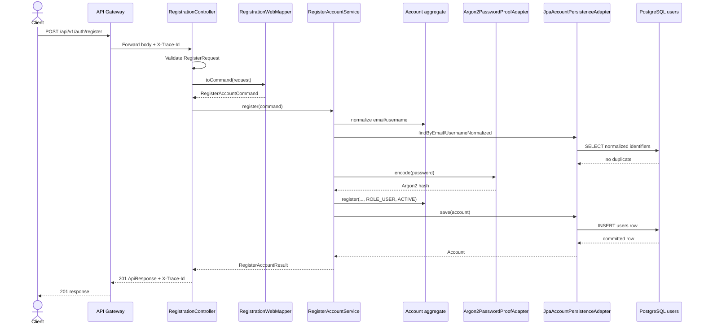
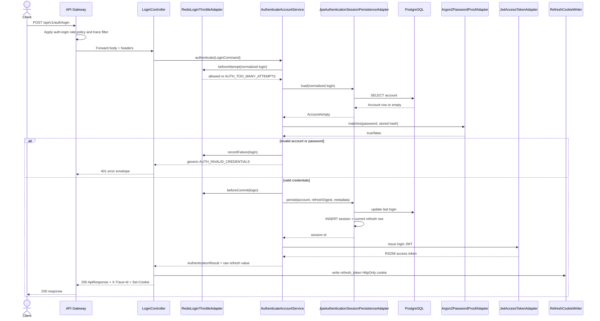
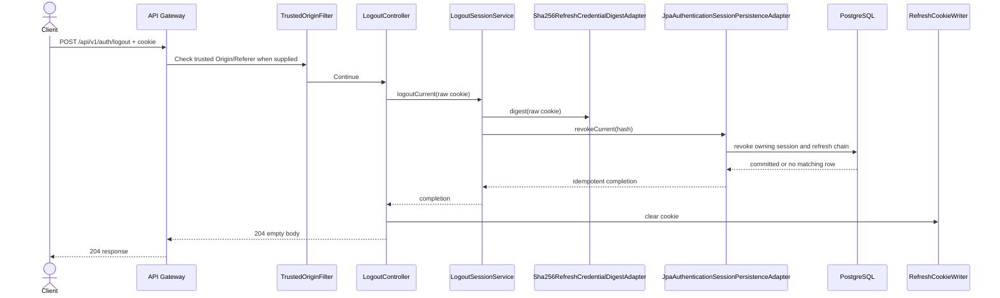
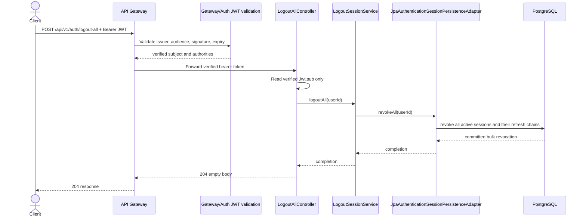
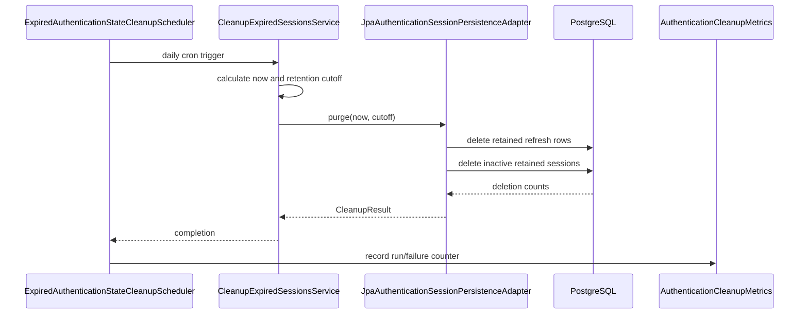

# Authentication flows and sequence diagrams

All public calls enter through the API Gateway. The Gateway validates/rate-limits at the edge and
forwards the request to Authentication. Authentication then runs the use case through inbound and
outbound ports. The diagrams show the important classes, not every framework filter.

## 1. Registration



The client cannot choose an administrator role. The raw password exists only in the command long
enough to be encoded; the response and database contain no raw password.

## 2. Login



The access token is returned in the response body. The refresh value is sent only through the
HttpOnly cookie. The database stores only its SHA-256 digest.

## 3. Refresh rotation

```mermaid
sequenceDiagram
    actor Client
    participant Gateway as API Gateway
    participant Origin as TrustedOriginFilter
    participant Controller as RefreshController
    participant UseCase as RefreshSessionService
    participant Digest as Sha256RefreshCredentialDigestAdapter
    participant DB as JpaAuthenticationSessionPersistenceAdapter
    participant Token as JwtAccessTokenAdapter
    participant Cookie as RefreshCookieWriter
    participant PostgreSQL as PostgreSQL row lock

    Client->>Gateway: POST /api/v1/auth/refresh + refresh_token cookie
    Gateway->>Gateway: Apply auth-refresh rate policy and trace filter
    Gateway->>Origin: Check exact Origin/Referer when supplied
    Origin->>Controller: Continue if trusted
    Controller->>UseCase: refresh(raw cookie)
    UseCase->>Digest: digest(raw cookie)
    Digest-->>UseCase: token hash
    UseCase->>DB: rotate(current hash, successor hash)
    DB->>PostgreSQL: SELECT current token FOR UPDATE
    alt current, active, and unexpired
        DB->>PostgreSQL: retire current, insert successor, update session activity
        PostgreSQL-->>DB: committed rotation
        DB-->>UseCase: account/session/expiry
        UseCase->>Token: issue refreshed JWT
        Token-->>UseCase: RS256 access token
        UseCase-->>Controller: replacement token + raw cookie
        Controller->>Cookie: replace refresh_token cookie
        Controller-->>Gateway: 200 + Set-Cookie + no-store
        Gateway-->>Client: 200 response
    else already used/replayed
        DB->>PostgreSQL: mark owning session COMPROMISED and revoke chain
        DB-->>UseCase: AUTH_REFRESH_REUSE_DETECTED
        UseCase-->>Controller: 401 error; clear cookie
        Controller-->>Gateway: 401 error envelope
    end
```

The row lock is the concurrency boundary: two requests using one current cookie cannot both
successfully rotate it. A replay compromises only that session chain.

## 4. Logout current session



## 5. Logout all sessions



## 6. Retention cleanup



## Error ownership

```text
Domain failure (AccountFailure/SessionFailure)
  -> AuthenticationHttpExceptionHandler
  -> Auth-owned {code,message,traceId}

Redis/JPA/provider failure in an adapter
  -> adapter translates to application/domain failure
  -> HTTP handler chooses status

Gateway policy/security failure
  -> Gateway error envelope

Downstream Auth response
  -> Gateway forwards status/body/headers without changing Auth ownership
```

This keeps the Gateway responsible for edge errors while Authentication remains responsible for
account and session semantics.
