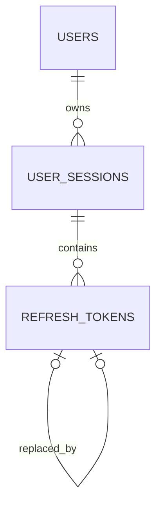

# Authentication Service Database Schema

`authentication-service` exclusively owns the authentication schema in PostgreSQL database
`auth_db`. The schema is created and evolved by Liquibase; no other service may read or write these
tables directly.

The database stores account identity, login sessions, and hashed refresh credentials. Access tokens
and private signing keys are not persisted here: access tokens are short-lived JWTs, while signing
keys are supplied through the authentication service configuration.

## Relationship overview



`refresh_tokens` forms a rotation chain. `parent_token_id` points to the credential used for a
rotation, and `replaced_by_token_id` points to its successor. The raw refresh credential is never
stored; only its SHA-256 hexadecimal digest is persisted.

## Tables

| Table | Responsibility | Important fields |
|---|---|---|
| `users` | Account identity and login state | Email/username identity, password hash, role, status, lock time, timestamps |
| `user_sessions` | Device/login-session lifecycle | User owner, status, device metadata, expiry, revocation metadata |
| `refresh_tokens` | Hashed refresh credentials and rotation history | Session owner, hash, parent/successor links, issue/expiry/use/revocation timestamps |

### `users`

| Column | Type | Rule |
|---|---|---|
| `id` | `UUID` | Primary key |
| `email` | `VARCHAR(320)` | Required; original presentation value |
| `email_normalized` | `VARCHAR(320)` | Required and unique; lookup identity |
| `username` | `VARCHAR(100)` | Optional |
| `username_normalized` | `VARCHAR(100)` | Optional and unique when present |
| `password_hash` | `VARCHAR(512)` | Required; password material is never stored in plaintext |
| `role` | `VARCHAR(32)` | `ROLE_USER` or `ROLE_ADMIN` |
| `status` | `VARCHAR(32)` | `ACTIVE`, `LOCKED`, or `DISABLED` |
| `locked_until` | `TIMESTAMPTZ` | Optional lock expiry |
| `last_login_at` | `TIMESTAMPTZ` | Optional successful-login timestamp |
| `created_at`, `updated_at` | `TIMESTAMPTZ` | Required audit timestamps |

### `user_sessions`

| Column | Type | Rule |
|---|---|---|
| `id` | `UUID` | Primary key |
| `user_id` | `UUID` | Required foreign key to `users`; cascade delete |
| `status` | `VARCHAR(32)` | `ACTIVE`, `REVOKED`, or `COMPROMISED` |
| `device_name` | `VARCHAR(150)` | Optional client/device label |
| `user_agent` | `VARCHAR(512)` | Optional request metadata |
| `ip_address` | `INET` | Optional source address |
| `created_at` | `TIMESTAMPTZ` | Required session creation time |
| `last_activity_at` | `TIMESTAMPTZ` | Optional activity timestamp |
| `expires_at` | `TIMESTAMPTZ` | Required and later than `created_at` |
| `revoked_at` | `TIMESTAMPTZ` | Required when status is revoked/compromised |
| `revoke_reason` | `VARCHAR(100)` | Optional bounded audit reason |

### `refresh_tokens`

| Column | Type | Rule |
|---|---|---|
| `id` | `UUID` | Primary key |
| `session_id` | `UUID` | Required foreign key to `user_sessions`; cascade delete |
| `token_hash` | `VARCHAR(64)` | Required, unique, lowercase 64-character hexadecimal digest |
| `parent_token_id` | `UUID` | Optional self-reference to the previous token |
| `replaced_by_token_id` | `UUID` | Optional self-reference to the successor token |
| `issued_at` | `TIMESTAMPTZ` | Required issue time |
| `expires_at` | `TIMESTAMPTZ` | Required and later than `issued_at` |
| `used_at` | `TIMESTAMPTZ` | Set when the credential is rotated/consumed |
| `revoked_at` | `TIMESTAMPTZ` | Set on logout or security revocation |
| `revoke_reason` | `VARCHAR(100)` | Optional bounded audit reason |

## Integrity and lifecycle rules

- A user may own many sessions; deleting a user cascades to sessions and their refresh tokens.
- A session may have many historical refresh-token rows, but only one current token per session:
  `used_at IS NULL AND revoked_at IS NULL`.
- A refresh token must not reference itself as its parent or successor.
- A token with a successor must already have `used_at` set.
- Reusing an already-used/revoked/expired refresh token compromises the owning session and revokes
  the token chain. This is application behavior backed by the persisted rotation links.
- Current-session logout revokes that session and its refresh chain; logout-all revokes every active
  session for the user.
- Expired and retained inactive rows are removed by the scheduled authentication cleanup process.
  The default retention is 30 days (`AUTH_RETENTION_DAYS`), with the schedule at 03:00 daily.
- The schema intentionally has no OAuth provider tables, access-token table, or private-key table in
  this MVP.

## Indexes and uniqueness

| Index or constraint | Purpose |
|---|---|
| `uq_users_email_normalized` | Case/format-normalized email lookup uniqueness |
| `uq_users_username_normalized` | Normalized username uniqueness |
| `idx_users_status` | Account status filtering |
| `idx_users_locked_until` | Locate accounts with an active lock |
| `idx_user_sessions_user_id` | Sessions for one user |
| `idx_user_sessions_active_by_user (user_id, expires_at) WHERE status = 'ACTIVE'` | Active-session lookup |
| `idx_user_sessions_expires_at` | Session cleanup by expiry |
| `uq_refresh_tokens_hash` | Prevent duplicate credential digests |
| `idx_refresh_tokens_session_id` | Rotation/logout chain lookup |
| `idx_refresh_tokens_expires_at` | Refresh-token cleanup by expiry |
| `uq_refresh_tokens_current_per_session` | Enforce one unused, non-revoked token per session |

## Migration ownership and operation

Source files:

```text
services/authentication-service/src/main/resources/db/changelog/
├── db.changelog-master.yaml
└── changes/
    ├── 001-create-authentication-schema.sql
    └── 002-align-refresh-token-hash-type.sql
```

The second changeset changes `refresh_tokens.token_hash` from the initial `CHAR(64)` declaration to
`VARCHAR(64)`. The final schema contract is therefore `VARCHAR(64)`.

Normal authentication replicas should keep:

```text
SPRING_LIQUIBASE_ENABLED=false
```

Run Liquibase once as a service-owned migration process before starting replicas. The local
procedure is documented in `infra/docker/README.md`; future Kubernetes deployment should use an
authentication-specific migration Job before rolling out the Deployment.

Never edit an applied changeset. Add a new numbered changeset for every future schema change and
update this document in the same change.

## Deliberately deferred

- OAuth/OIDC provider and consent storage
- MFA/WebAuthn credentials
- Password-reset and email-verification tokens
- Persistent access-token or blacklist storage
- Cross-service user profile data
- Audit-event/outbox tables for authentication events
