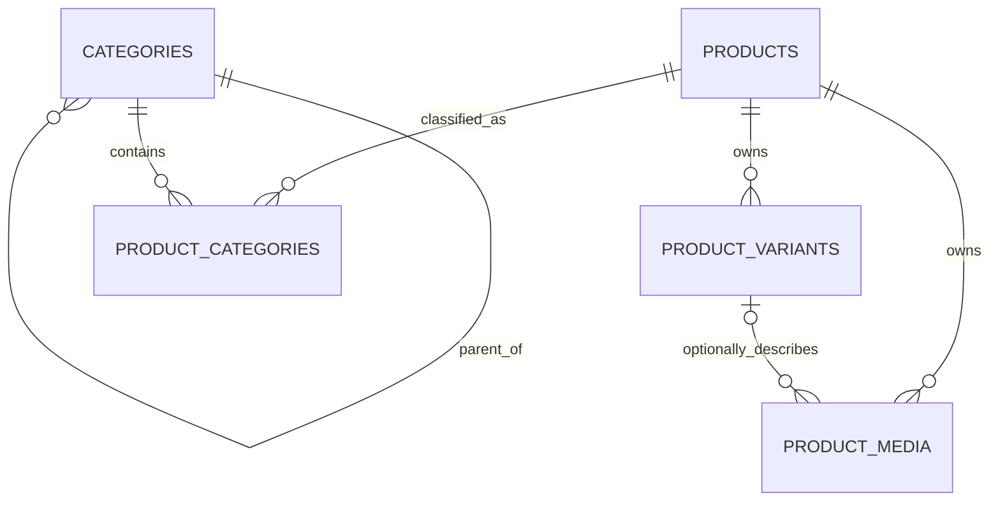

# Product Service Database Schema

`product-service` exclusively owns the catalog schema in PostgreSQL database `product_db`. This document describes the initial schema created by Liquibase changeset `philia:001-create-product-catalog-schema`.

The database is the durable source of truth for Product catalog data only. Other services consume future documented HTTP/event contracts; they never query these tables directly.

## Relationship overview



The Media-to-Variant relationship is composite: `(product_id, variant_id)` references `(product_id, id)` on `product_variants`. This prevents Media owned by one Product from pointing at another Product's Variant.

## Tables

| Table | Responsibility | Important fields |
|---|---|---|
| `categories` | Hierarchical catalog grouping | `parent_id`, unique `code`/`slug`, status, order, timestamps, version |
| `products` | Catalog-level Product | unique `code`/`slug`, descriptions, JSON attributes, status, publication time, timestamps, version |
| `product_variants` | Concrete sellable SKU | Product owner, unique SKU/barcode, JSON attributes, Money, status, weight, order, timestamps, version |
| `product_categories` | Ordered many-to-many membership | Product, Category, primary flag, order, creation time |
| `product_media` | Product- or Variant-level image/video | Product, optional same-Product Variant, URL/metadata, dimensions, size, order, status |

## Money rule

Money stays together on each Variant:

```text
base_price NUMERIC(19,4) + currency CHAR(3)
```

The initial schema accepts only non-negative VND amounts. It intentionally has no Product-level currency and no campaign/sale price. Multi-market or dated pricing requires a later approved price-model feature.

## Required integrity

- Required codes, slugs, names, SKU, and Media URLs cannot be blank.
- Category/Product/Variant/Media lifecycle values are limited to their documented states.
- Product and Variant `attributes` must be JSON objects.
- Order and optimistic version values cannot be negative.
- Optional weight, width, height, and file size must be positive when present.
- At most one category membership is primary for a Product.
- Natural keys are unique, including non-null barcode.
- All six foreign keys use `ON DELETE RESTRICT`.
- Product-level Media may omit `variant_id`; Variant-level Media must reference a Variant owned by the same Product.

Category cycles are not solved by the self-referencing foreign key. A future category-management domain feature must validate them.

## Indexes

| Index | Query/integrity purpose |
|---|---|
| `idx_categories_parent_sort (parent_id, sort_order, id)` | Deterministic child-category listing |
| `idx_products_status_published (status, published_at DESC, id)` | Product lifecycle/publication browsing |
| `idx_product_variants_product_sort (product_id, sort_order, id)` | Ordered Product Variant listing |
| `idx_product_categories_category_sort_product (category_id, sort_order, product_id)` | Deterministic products-by-category listing |
| `uq_product_categories_one_primary (product_id) WHERE is_primary = TRUE` | At most one primary Category per Product |
| `idx_product_media_product_variant_sort (product_id, variant_id, sort_order, id)` | Ordered Product/Variant gallery listing |

The partial primary-category index is an integrity mechanism, not a speculative browsing optimization.

## Migration ownership and operation

Source files:

```text
services/product-service/src/main/resources/db/changelog/
├── db.changelog-master.yaml
└── changes/001-create-product-catalog-schema.sql
```

Normal Product replicas receive the `product_db` datasource but keep:

```text
SPRING_LIQUIBASE_ENABLED=false
```

Local migration runs as a one-off non-web Product process with Liquibase enabled. Future Kubernetes deployment should use a Product-specific migration Job before rolling out Product Deployment replicas. The exact local procedure is in `specs/008-product-catalog-schema/quickstart.md` and `infra/docker/README.md`.

Never edit this changeset after it has been applied to a shared environment. Add a new changeset for future schema changes.

## Deliberately deferred

- Brand management
- Inventory, stock, quota, and reservation
- Campaign snapshots and sale prices
- Cart, Order, Payment, identity, or notification state
- Search documents/indexes
- Product API/JPA mappings
- Kafka events and Outbox storage
- Category-cycle enforcement and hard-delete workflows
