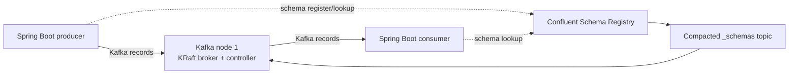

# Local Kafka and Confluent Schema Registry

## 1. Scope

This document describes the repository's existing local platform and the safe path for adopting
Schema Registry. It does not authorize production/VPS exposure or change the checked-in Compose
configuration.

## 2. Actual local topology



The repository currently pins:

```text
Kafka:           apache/kafka:4.0.0
Schema Registry: confluentinc/cp-schema-registry:8.3.0
```

These are different product image lines, so they cannot share one `CONFLUENT_VERSION` variable.
Keep the independent `KAFKA_IMAGE` and `SCHEMA_REGISTRY_IMAGE` values unless an approved
infrastructure change replaces the Apache broker image with a Confluent Platform broker image.

Confluent documents Schema Registry as compatible with supported Kafka broker lines, but the exact
mixed-image pair must still pass this repository's smoke and integration tests before service
adoption. Do not infer application client compatibility from broker version alone; let the Spring
Boot BOM manage `kafka-clients`. Feature 017 uses the Confluent 7.9.x Java serializer/client line
because it is compatible with Spring Kafka's managed Kafka 3.9.x client; the Registry server image
remains 8.3.x and is validated separately through the live compatibility test.

## 3. Network addresses

| Caller | Kafka bootstrap address | Schema Registry address |
|---|---|---|
| Service inside `flash-sale-net` | `kafka:9092` | `http://schema-registry:8081` |
| IDE/CLI on the host | `localhost:29092` | `http://localhost:8081` |

A container must not use `localhost:29092` to reach Kafka. Inside that container, `localhost`
means the container itself.

The host ports bind to `127.0.0.1` by default. Preserve this for local/VPS development; Kafka and
Schema Registry must not be exposed directly to the public internet.

## 4. KRaft single-node meaning

The node has:

```text
node.id=1
process.roles=broker,controller
```

There is no master broker. The same process handles data and metadata control, and every partition
leader lives on that one broker. This keeps local operation small but provides no broker or
controller failover. Apache Kafka describes combined mode as suitable for development and advises
against it for critical deployments.

Current single-node internal-topic settings use replication factor `1`. `acks=all` remains a good
producer setting for portable code, but on one broker it cannot create a second copy of a record.

## 5. Configuration ownership

| Asset | Owner/location |
|---|---|
| Local Kafka and Registry services | `infra/docker/compose.yml` |
| Safe image/port defaults | `infra/docker/.env.example` |
| Developer secrets/overrides | `infra/docker/.env`, ignored by Git |
| Service Kafka/Registry clients | Owning service's `application.yml` and POM |
| Topic provisioning | Root-owned scripts under `infra/docker/kafka/` after feature approval |
| Event schemas | Approved Feature 017 Avro SpecificRecord schemas under `contracts/kafka-avro-contracts/`; later schemas require their own approved feature |

Services never read or write `_schemas` directly. They use Schema Registry's HTTP API through the
serializer, deserializer, CI tooling, or controlled administrative tooling.

## 6. Start and smoke test

Create a real local environment file first:

```powershell
Copy-Item infra/docker/.env.example infra/docker/.env
```

Start only messaging infrastructure:

```powershell
docker compose --env-file infra/docker/.env -f infra/docker/compose.yml up -d kafka schema-registry
docker compose --env-file infra/docker/.env -f infra/docker/compose.yml ps kafka schema-registry
```

Check Registry:

```powershell
curl http://localhost:8081/subjects
curl http://localhost:8081/config
```

Check Kafka from the broker container:

```powershell
docker compose --env-file infra/docker/.env -f infra/docker/compose.yml exec kafka `
  /opt/kafka/bin/kafka-topics.sh --bootstrap-server kafka:9092 --list
```

Inspect logs when either health check fails:

```powershell
docker compose --env-file infra/docker/.env -f infra/docker/compose.yml logs kafka schema-registry
```

## 7. Topic provisioning policy

The current Compose file does not explicitly disable Kafka automatic topic creation. Before the
first approved business producer is deployed, add an approved infrastructure task to:

1. set `KAFKA_AUTO_CREATE_TOPICS_ENABLE=false`;
2. create only approved topics through a repeatable script or manifest;
3. record partitions, replication factor, retention, cleanup policy, and maximum message size;
4. validate topic configuration in CI or a smoke test.

A reasonable local learning preset is:

```text
business topic partitions = 3
replication factor         = 1
```

This permits consumer-group parallelism while preserving per-key order, but it is only a local
default. Retention, compaction, and message-size settings belong to the owning feature and must not
be guessed globally.

Only `campaign.lifecycle.v1` is currently approved as a topic. Its Avro SpecificRecord producer
and Campaign outbox publisher are implemented; the root-owned provisioning script verifies the
local topic shape. Topic families in the Saga design remain candidates until their
producer, consumers, schemas, keys, retention, and recovery are approved.

## 8. Schema Registry storage and availability

Schema Registry stores subjects, versions, compatibility settings, and related metadata in its
compacted `_schemas` topic. The current configuration uses replication factor `1`, matching the
one-broker environment.

Consequences:

- Kafka unavailable means Registry cannot serve normal schema operations reliably;
- Registry unavailable can block serializer/deserializer schema lookups even while Kafka runs;
- a local persistent Kafka volume protects against a normal container restart, not node loss;
- deleting the Kafka volume deletes the local broker data and Registry schema history.

Never delete the volume as a normal schema migration procedure.

## 9. Local versus production security

| Environment | Minimum direction |
|---|---|
| Local Compose | Loopback host binding and private Docker network; PLAINTEXT is local-only |
| Public VPS | Do not expose broker/Registry ports; private network plus Kafka auth/TLS and Registry auth/TLS |
| Kubernetes | Internal Services, Secrets, NetworkPolicy, TLS/SASL/ACLs, multiple brokers/controllers/Registry instances |

The `producer` field inside an event is observability metadata, not client authentication. Kafka
identity must come from broker authentication and topic ACLs.

## 10. Scaling path

```text
Local/MVP                              Later critical environment
1 combined KRaft node              -> isolated controllers and multiple brokers
RF 1                               -> RF 3 with an approved min ISR
one Registry instance              -> multiple Registry instances
PLAINTEXT/private network          -> TLS/SASL plus ACLs
Docker volume                      -> durable managed storage and backups
Compose                            -> approved Kubernetes/operator deployment
```

Scaling infrastructure must not require changing business event semantics. It may require an ADR,
new deployment manifests, capacity tests, and an explicit migration/runbook.

## Official references

- [Apache Kafka KRaft deployment considerations](https://kafka.apache.org/40/operations/kraft/)
- [Confluent Platform versions and interoperability](https://docs.confluent.io/platform/current/installation/versions-interoperability.html)
- [Confluent Schema Registry configuration](https://docs.confluent.io/platform/current/schema-registry/installation/config.html)
