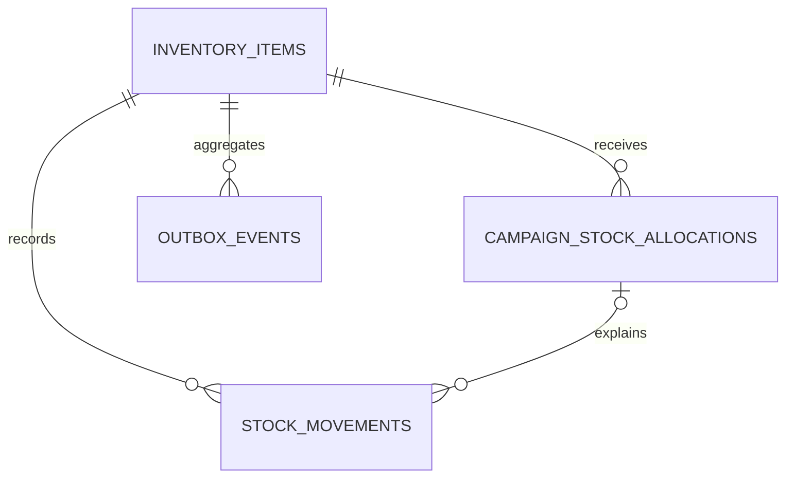

# Inventory Service Data Model

## Ownership

The `inventory-service` owns PostgreSQL database `inventory_db`. `variant_id` and `campaign_id` are
logical identifiers only; no foreign key crosses a service boundary.

## Entity relationship



## `inventory_items`

| Field | Rule |
|---|---|
| `id` | UUID primary key |
| `variant_id` | Required, unique logical Product variant ID |
| `sku_snapshot` | Optional read-only, non-authoritative initialization snapshot; future Product update events may refresh it |
| `on_hand_quantity` | `BIGINT`, default 0, non-negative |
| `campaign_allocated_quantity` | `BIGINT`, default 0, non-negative and never greater than on-hand |
| `version` | Optimistic-lock version, non-negative |
| `created_at`, `updated_at` | Required timestamps |

Derived, not persisted:

```text
available_quantity = on_hand_quantity - campaign_allocated_quantity
```

## `campaign_stock_allocations`

| Field | Rule |
|---|---|
| `id` | UUID primary key |
| `request_id` | Required unique command identity |
| `campaign_id`, `variant_id` | Required logical external IDs |
| `inventory_item_id` | Required FK to local `inventory_items` |
| `allocated_quantity` | Positive |
| `sold_quantity`, `returned_quantity` | Non-negative; settlement must equal allocation |
| `status` | `ACTIVE`, `RELEASED`, or `RECONCILED` |
| timestamps | Created/updated and optional reconciled timestamp |

Unique `(campaign_id, variant_id)` enforces the Phase 1 one-allocation rule.

## `stock_movements`

Immutable audit rows contain command `request_id`, local inventory/allocation IDs, optional reference
type/ID, movement type, on-hand and allocated deltas, resulting balances, reason, and creation time.
Every successful mutation creates exactly one row. `on_hand_after` and `allocated_after` are non-negative;
at least one delta must be non-zero.

## `outbox_events`

Outbox rows contain aggregate type/ID, versioned event type, JSON payload, `PENDING`/`PUBLISHED`/`FAILED`
status, retry count, occurred/published timestamps, and bounded last-error text. Pending rows are indexed
for publisher polling.

## State transitions

```text
ACTIVE -> RELEASED
ACTIVE -> RECONCILED
RELEASED and RECONCILED -> terminal
```

Reconciliation requires `sold_quantity + returned_quantity = allocated_quantity`; on-hand decreases only
by sold quantity, while allocated decreases by the full allocation.

## Migration requirements

Liquibase changesets must create these tables, checks, indexes, and unique constraints in dependency order.
Applied changesets are immutable; future changes use new numbered changesets.
