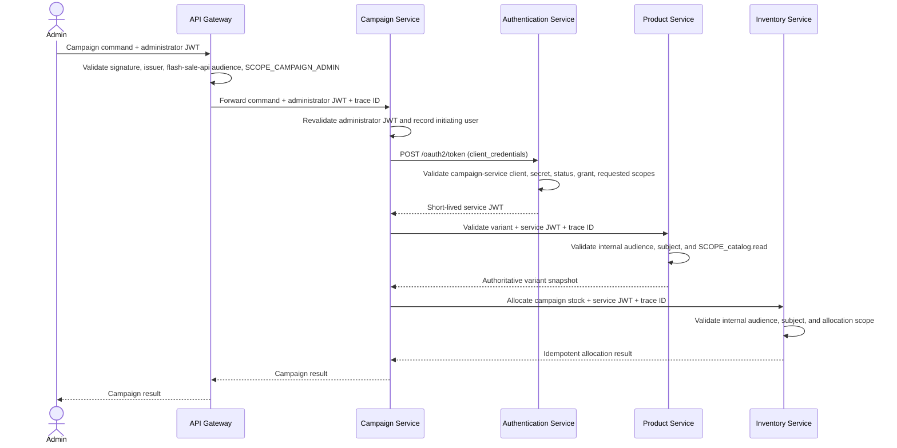

# Campaign Service-to-Service Authentication Contract

**Feature**: `017-campaign-management-mvp`  
**Status**: Approved  
**Decision date**: 2026-07-30  
**Governing ADRs**: `docs/adr/0012-campaign-oauth2-client-credentials.md` and
`docs/adr/0013-flashsale-campaign-snapshot-identity.md`

## Purpose

This contract separates the administrator identity that initiates a Campaign command from the
machine identities used for internal calls. It governs Campaign-to-Product/Inventory calls and the
Flash-Sale-to-Campaign snapshot call, including token issuance, claims, scopes, downstream
validation, credential handling, audit identity, and rollout.

## Identity boundaries

| Identity | Enters through | Token audience | Required authority | May be relayed downstream? |
|---|---|---|---|---|
| Campaign administrator | API Gateway | `flash-sale-api` | `SCOPE_CAMPAIGN_ADMIN` | No |
| Campaign Service | Authentication token endpoint | `flash-sale-internal-api` | Endpoint-specific service scope | Yes, only to the addressed internal endpoint |
| Flash Sale Service | Authentication token endpoint | `flash-sale-internal-api` | `SCOPE_campaign.snapshot.read` | Yes, only to the Campaign snapshot endpoint |

The administrator token authenticates and authorizes the user at Gateway and Campaign Service. It
MUST NOT be persisted, placed in durable operations, used by background workers, or forwarded to
Product or Inventory.

Campaign Service authenticates itself to Authentication Service and receives a short-lived service
access token. That token authorizes the downstream call; it does not replace the initiating user in
Campaign audit data.

## End-to-end flow



A recovery worker follows the same Auth-to-Product/Inventory path without requiring the initiating
administrator to remain online. It reuses the durable schedule-operation and Inventory request
identities.

Flash Sale Service obtains a separate service token and calls the Campaign internal snapshot with
`SCOPE_campaign.snapshot.read`. It never uses Campaign's client credentials or service token.

## Token endpoint

### Request

```http
POST /oauth2/token HTTP/1.1
Authorization: Basic base64(campaign-service:<client-secret>)
Content-Type: application/x-www-form-urlencoded

grant_type=client_credentials&scope=catalog.read%20inventory.campaign.allocate
```

Authentication Service MUST verify all of the following before issuing a token:

- the client registration exists;
- the submitted secret matches its stored non-reversible hash;
- client status is `ACTIVE`;
- `client_credentials` is an allowed grant;
- every requested scope is registered for that client.

### Success response

```json
{
  "access_token": "<signed-jwt>",
  "token_type": "Bearer",
  "expires_in": 300,
  "scope": "catalog.read inventory.campaign.allocate"
}
```

No refresh token is issued for the Client Credentials grant. Campaign Service obtains a new access
token when renewal is required.

## Service-token claims

```json
{
  "iss": "http://authentication-service:8080",
  "sub": "campaign-service",
  "aud": ["flash-sale-internal-api"],
  "scope": [
    "catalog.read",
    "inventory.campaign.allocate"
  ],
  "iat": 1785369600,
  "exp": 1785369900
}
```

Normative rules:

- tokens are signed with RS256 and published key material remains available through the approved
  Authentication Service JWKS endpoint;
- token lifetime MUST NOT exceed 300 seconds;
- `sub` MUST identify `campaign-service`;
- only requested scopes that are allowed by the client registration may appear;
- `inventory.campaign.release` may be registered for the future release feature, but Feature 017
  does not request or exercise it during scheduling.

Spring Security resource servers expose a granted `scope` value as an authority prefixed with
`SCOPE_`.

## Authorization matrix

| Caller and operation | Resource endpoint | Audience | Required authority |
|---|---|---|---|
| Administrator manages Campaign | `/api/v1/admin/campaigns/**` | `flash-sale-api` | `SCOPE_CAMPAIGN_ADMIN` |
| Campaign validates a variant | Product internal campaign-validation endpoint | `flash-sale-internal-api` | `SCOPE_catalog.read` |
| Campaign allocates stock | `POST /internal/v1/campaign-stock-allocations` | `flash-sale-internal-api` | `SCOPE_inventory.campaign.allocate` |
| Campaign releases stock in a future approved feature | Future Inventory release endpoint | `flash-sale-internal-api` | `SCOPE_inventory.campaign.release` |
| Flash Sale rebuilds campaign runtime state | Campaign internal snapshot endpoint | `flash-sale-internal-api` | `SCOPE_campaign.snapshot.read` |

Product, Inventory, and Campaign internal endpoints MUST validate signature, issuer, expiration,
audience, subject, and required authority independently. A valid administrator token with the public
API audience is not a valid service token. A valid Campaign service token is not a valid
administrator token and MUST NOT authorize the Flash Sale snapshot call.

## Client registration

Authentication Service owns durable client registration. The approved logical model is:

```text
oauth_clients
  id
  client_id                  = campaign-service
  client_secret_hash
  grant_type                 = client_credentials
  status                     = ACTIVE
  access_token_ttl_seconds   = 300
  created_at
  updated_at

oauth_client_scopes
  client_id
  scope
```

Allowed scopes for the Campaign client are:

- `catalog.read`;
- `inventory.campaign.allocate`;
- `inventory.campaign.release` (reserved for a later approved release feature).

Authentication Service MUST NOT issue a broad Inventory write authority to this client.

Authentication Service also owns a separate `flashsale-service` client registration. That client is
allowed `campaign.snapshot.read` and MUST NOT share credentials with `campaign-service`.

## Secret and token handling

Campaign Service reads:

```text
CAMPAIGN_CLIENT_ID
CAMPAIGN_CLIENT_SECRET
```

The client secret belongs in a local untracked environment file or Docker secret and in a
Kubernetes Secret for Kubernetes deployments. It MUST NOT be committed, logged, stored in Campaign
tables, or baked into the image.

Campaign Service MAY cache the access token only in process memory and MUST renew it before expiry.
It MUST NOT persist or log the token. Multiple Campaign replicas each manage their own in-memory
cache; no shared token store is required.

## Audit and tracing

Campaign-owned audit records preserve separate fields or equivalent structured values for:

- the initiating administrator/user identity;
- the calling service identity (`campaign-service`) when downstream work is performed;
- the correlation/trace identity.

Examples include `createdBy`, `updatedBy`, `initiatedBy`, `callerService`, and `correlationId` on the
Campaign-owned records defined by the approved data model. A background retry retains the original
initiating user and records Campaign Service as the executing caller.

The inbound trace identity MUST be propagated to the token acquisition and downstream calls without
putting tokens or client secrets in logs.

## Compatibility and rollout

The rollout order is:

1. Authentication Service adds the Client Credentials endpoint, client registry, service audience,
   and separate Campaign/Flash Sale client registrations without changing existing
   administrator-token behavior.
2. Product and Inventory add endpoint-specific internal-audience validation and narrow scopes.
3. Campaign Service adds token acquisition/cache and calls only endpoints that accept the new
   service identity.
4. Gateway and Campaign administration adopt `SCOPE_CAMPAIGN_ADMIN` consistently.

Existing administrator access tokens retain the `flash-sale-api` audience. The two audiences MUST
not be treated as interchangeable during or after rollout.

## Required verification

- valid Campaign client credentials issue a short-lived service token;
- unknown, inactive, wrong-secret, disallowed-grant, and disallowed-scope requests are denied;
- no refresh token is returned;
- Product accepts only the internal audience plus `SCOPE_catalog.read` for validation;
- Inventory accepts only the internal audience plus
  `SCOPE_inventory.campaign.allocate` for allocation;
- Campaign snapshot accepts only subject `flashsale-service`, the internal audience, and
  `SCOPE_campaign.snapshot.read`;
- administrator/service token substitution is denied;
- wrong issuer, audience, subject, signature, expiry, and scope are denied;
- administrator bearer tokens never appear in downstream request capture, durable Campaign data, or
  logs;
- background recovery can obtain a service token and reuse the stable Inventory request identity;
- trace identity is preserved without exposing credentials.
