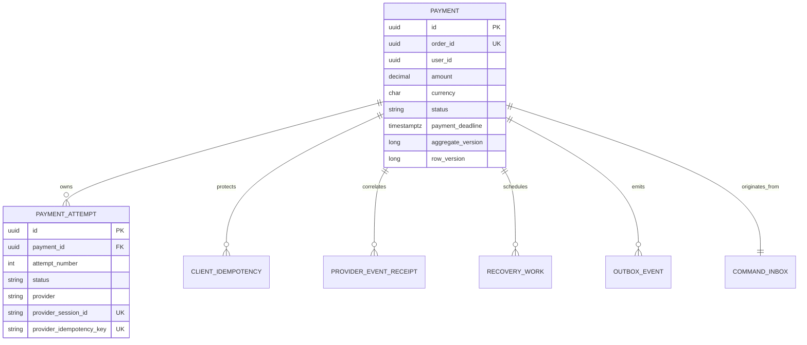
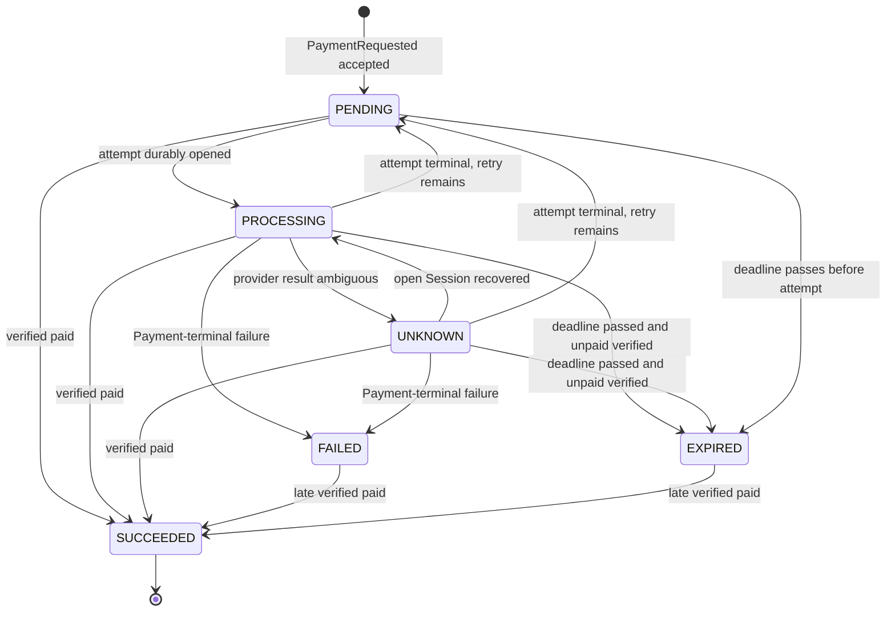
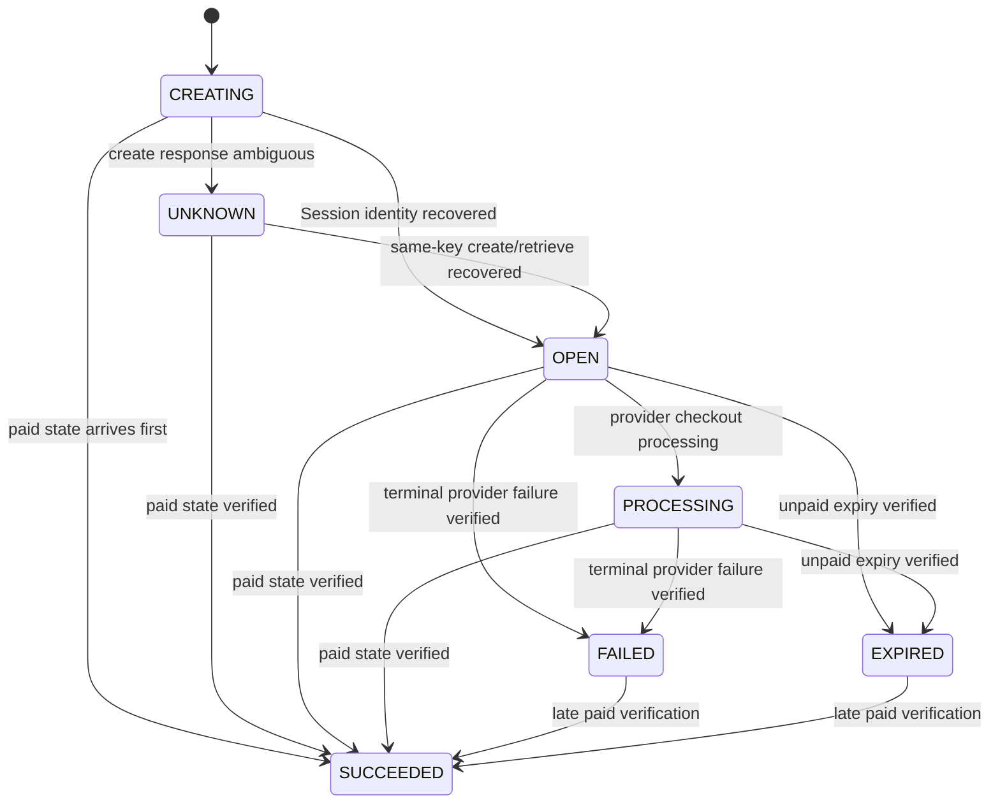

# Data Model: Payment Service MVP

**Date**: 2026-08-17
**Database owner**: Payment Service (`payment_db`)
**Durable source of truth**: PostgreSQL

This model describes domain entities, persistence records, invariants, indexes, and transaction
boundaries. Names are logical until Liquibase/JPA implementation; the contracts and invariants are
binding once this plan is approved.

## 1. Aggregate overview



## 2. Domain entities

### 2.1 Payment (aggregate root)

| Field | Type | Rules |
|---|---|---|
| `id` | UUID | Service-generated immutable identity. |
| `orderId` | UUID | Immutable; globally unique in Payment Service; Kafka ordering key. |
| `userId` | UUID | Immutable owner copied from the trusted command. |
| `amount` | decimal(19,4) | Positive; immutable; exact comparison only. |
| `currency` | ISO 4217 string | Uppercase 3 characters; immutable; MVP provider path accepts approved Stripe currency, initially VND. |
| `paymentDeadline` | instant | Immutable absolute deadline copied from the command. |
| `status` | enum | `PENDING`, `PROCESSING`, `UNKNOWN`, `SUCCEEDED`, `FAILED`, `EXPIRED`. |
| `failureReason` | enum/null | Present only for an established failed/expired outcome. |
| `succeededAt` | instant/null | Provider-confirmed payment time when known. |
| `aggregateVersion` | long | Starts at 0; increments exactly once for each externally observable Payment fact. |
| `createdAt` / `updatedAt` | instant | Server-generated audit timestamps. |
| `rowVersion` | long | Persistence concurrency version; not part of Kafka ordering. |

**Invariants**:

1. One Payment exists for one `orderId`.
2. User, order, amount, currency, and deadline never change.
3. No Checkout attempt begins after `paymentDeadline`.
4. At most three sequential attempts exist; card retries inside one Stripe Session are not attempts.
5. At most one unresolved attempt (`CREATING`, `OPEN`, `PROCESSING`, or `UNKNOWN`) exists at a time.
6. `SUCCEEDED` never regresses.
7. A provider-verified paid outcome may move `PENDING`, `PROCESSING`, `UNKNOWN`, `FAILED`, or
   `EXPIRED` to `SUCCEEDED`. This is the deliberate late-success rule.
8. Transient infrastructure/provider uncertainty does not create `PaymentFailed.v1`.
9. Payment facts are emitted only through the outbox with the version assigned by the aggregate.

### 2.2 PaymentAttempt

| Field | Type | Rules |
|---|---|---|
| `id` | UUID | Service-generated immutable identity. |
| `paymentId` | UUID | Required parent Payment. |
| `attemptNumber` | integer | 1–3; unique per Payment. |
| `status` | enum | `CREATING`, `OPEN`, `PROCESSING`, `UNKNOWN`, `SUCCEEDED`, `FAILED`, `EXPIRED`. |
| `provider` | enum | MVP value `STRIPE`. |
| `providerIdempotencyKey` | string | Service-generated, unique, opaque, stable for the entire provider create lifecycle. |
| `providerSessionId` | string/null | Unique once known; safe provider identity, not a URL. |
| `providerPaymentIntentId` | string/null | Optional safe provider identity after available. |
| `firstSubmittedAt` | instant/null | First provider create submission. |
| `safeReplayUntil` | instant/null | 23 hours after first submission for ambiguous create recovery. |
| `providerExpiresAt` | instant/null | Observed provider Session expiry; not the canonical business deadline. |
| `lastProviderState` | string/null | Allowlisted normalized state, never raw JSON. |
| `failureReason` | enum/null | Established terminal reason only. |
| `createdAt` / `updatedAt` | instant | Audit timestamps. |
| `rowVersion` | long | Optimistic concurrency control. |

**Attempt rules**:

- `CREATING` is persisted before the remote POST.
- `UNKNOWN` means execution/result is ambiguous and must be reconciled with the same provider key.
- A new attempt may open only after the previous attempt is proven terminal and the Payment remains
  payable.
- An expired/failed attempt may still converge to `SUCCEEDED` when Stripe verifies payment.
- The Checkout URL is never a field.

## 3. State transitions

### 3.1 Payment state machine



An attempt-level `FAILED`/`EXPIRED` outcome returns the Payment to `PENDING` only when the business
deadline has not passed and fewer than three attempts exist. Payment-level `FAILED` and `EXPIRED`
are terminal except for a verified late success. `CHECKOUT_ATTEMPT_LIMIT_REACHED` is Payment-terminal.
The success-dominant arrows are intentional and generate a higher-version success fact if a failure
fact was already emitted.

### 3.2 PaymentAttempt state machine



## 4. Persistence tables

All timestamps use `TIMESTAMPTZ`. All identifiers use PostgreSQL UUID. Foreign keys remain inside
`payment_db`; no cross-service foreign key is allowed.

### 4.1 `payments`

| Column | SQL type | Null | Constraint/index |
|---|---|---:|---|
| `id` | UUID | no | PK |
| `order_id` | UUID | no | unique |
| `user_id` | UUID | no | index `(user_id, created_at desc)` |
| `amount` | NUMERIC(19,4) | no | check `amount > 0` |
| `currency` | CHAR(3) | no | uppercase check |
| `payment_deadline` | TIMESTAMPTZ | no | index for deadline recovery |
| `status` | VARCHAR(32) | no | check enum; index `(status, updated_at)` |
| `failure_reason` | VARCHAR(64) | yes | allowlisted enum |
| `succeeded_at` | TIMESTAMPTZ | yes | |
| `aggregate_version` | BIGINT | no | check `>= 0` |
| `row_version` | BIGINT | no | JPA `@Version` |
| `created_at` | TIMESTAMPTZ | no | |
| `updated_at` | TIMESTAMPTZ | no | |

### 4.2 `payment_attempts`

| Column | SQL type | Null | Constraint/index |
|---|---|---:|---|
| `id` | UUID | no | PK |
| `payment_id` | UUID | no | FK `payments(id)`; index |
| `attempt_number` | SMALLINT | no | unique `(payment_id, attempt_number)`; check 1–3 |
| `status` | VARCHAR(32) | no | check enum |
| `provider` | VARCHAR(16) | no | `STRIPE` |
| `provider_idempotency_key` | VARCHAR(255) | no | unique |
| `provider_session_id` | VARCHAR(255) | yes | unique when non-null |
| `provider_payment_intent_id` | VARCHAR(255) | yes | index when non-null |
| `first_submitted_at` | TIMESTAMPTZ | yes | |
| `safe_replay_until` | TIMESTAMPTZ | yes | recovery index |
| `provider_expires_at` | TIMESTAMPTZ | yes | |
| `last_provider_state` | VARCHAR(32) | yes | normalized allowlist |
| `failure_reason` | VARCHAR(64) | yes | allowlisted enum |
| `row_version` | BIGINT | no | JPA `@Version` |
| `created_at` / `updated_at` | TIMESTAMPTZ | no | |

Required PostgreSQL partial unique index:

```sql
CREATE UNIQUE INDEX uk_payment_attempt_one_unresolved
ON payment_attempts (payment_id)
WHERE status IN ('CREATING', 'OPEN', 'PROCESSING', 'UNKNOWN');
```

This database constraint is the final defense against two replicas opening concurrent Sessions.

### 4.3 `payment_command_inbox`

Durably deduplicates `PaymentRequested.v1` and detects conflicting redelivery.

| Column | SQL type | Null | Constraint/index |
|---|---|---:|---|
| `event_id` | UUID | no | PK |
| `event_type` | VARCHAR(64) | no | expected `PaymentRequested` |
| `event_version` | SMALLINT | no | expected 1 |
| `order_id` | UUID | no | unique for this command lifecycle |
| `payload_fingerprint` | CHAR(64) | no | SHA-256 of canonical business fields |
| `payment_id` | UUID | yes | FK after aggregate creation |
| `processing_status` | VARCHAR(24) | no | `RECEIVED`, `PROCESSED`, `CONFLICTED` |
| `received_at` / `processed_at` | TIMESTAMPTZ | no/yes | |

The inbox insert, Payment creation, and initial status are one transaction. Duplicate event ID with
the same fingerprint is a no-op. Same order/event identity with a different fingerprint is a
contract conflict and must be observable, not overwritten.

### 4.4 `payment_client_idempotency`

| Column | SQL type | Null | Constraint/index |
|---|---|---:|---|
| `id` | UUID | no | PK |
| `operation` | VARCHAR(64) | no | `CREATE_OR_RESUME_CHECKOUT` |
| `key_digest` | CHAR(64) | no | unique `(operation, key_digest)` |
| `user_id` | UUID | no | conflict ownership check |
| `payment_id` | UUID | no | FK |
| `request_fingerprint` | CHAR(64) | no | canonical method/path/body identity |
| `attempt_id` | UUID | yes | FK once attempt allocated |
| `outcome_status` | VARCHAR(24) | no | `ACCEPTED`, `AVAILABLE`, `RECOVERING` |
| `created_at` / `updated_at` | TIMESTAMPTZ | no | |

Do not persist or log the raw client key. Records are not automatically deleted in MVP because
retention behavior is outside the approved scope; future cleanup requires an explicit policy.

### 4.5 `payment_provider_event_receipts`

| Column | SQL type | Null | Constraint/index |
|---|---|---:|---|
| `id` | UUID | no | PK; internal receipt/causation identity |
| `provider_event_id` | VARCHAR(255) | no | unique; Stripe event identity |
| `provider_event_type` | VARCHAR(128) | no | allowlisted/observed type |
| `provider_api_version` | VARCHAR(32) | yes | safe metadata only |
| `live_mode` | BOOLEAN | no | must match environment |
| `provider_object_id` | VARCHAR(255) | yes | Checkout Session/object ID |
| `payment_id` | UUID | yes | safe metadata resolution; FK when known |
| `attempt_id` | UUID | yes | safe metadata resolution; FK when known |
| `order_id` | UUID | yes | correlation only |
| `provider_created_at` | TIMESTAMPTZ | no | Stripe event timestamp |
| `verified_at` | TIMESTAMPTZ | no | signature verification time |
| `processing_status` | VARCHAR(24) | no | `PENDING`, `IN_PROGRESS`, `PROCESSED`, `IGNORED`, `MANUAL_REVIEW` |
| `lease_owner` / `lease_until` | VARCHAR(128)/TIMESTAMPTZ | yes | crash-safe worker claim |
| `attempt_count` | INTEGER | no | processing attempts |
| `next_attempt_at` | TIMESTAMPTZ | no | index with status |
| `last_error_code` | VARCHAR(64) | yes | redacted classification only |
| `processed_at` | TIMESTAMPTZ | yes | |

The raw webhook body, signature, Checkout URL, provider error body, customer/card fields, and full
Stripe object are prohibited columns.

### 4.6 `payment_recovery_work`

| Column | SQL type | Null | Constraint/index |
|---|---|---:|---|
| `id` | UUID | no | PK |
| `payment_id` | UUID | no | FK |
| `attempt_id` | UUID | yes | FK where attempt-specific |
| `work_type` | VARCHAR(32) | no | `CREATE_SESSION`, `REFRESH_SESSION`, `EXPIRE_SESSION` |
| `status` | VARCHAR(24) | no | `PENDING`, `IN_PROGRESS`, `COMPLETED`, `MANUAL_REVIEW` |
| `provider_idempotency_key` | VARCHAR(255) | yes | required for create replay |
| `safe_replay_until` | TIMESTAMPTZ | yes | required for create replay |
| `attempt_count` | INTEGER | no | check `>= 0` |
| `next_attempt_at` | TIMESTAMPTZ | no | claim index |
| `lease_owner` / `lease_until` | VARCHAR(128)/TIMESTAMPTZ | yes | reclaimable lease |
| `last_error_code` | VARCHAR(64) | yes | redacted category |
| `created_at` / `updated_at` | TIMESTAMPTZ | no | |

Unique active work is required for `(attempt_id, work_type)` where status is `PENDING` or
`IN_PROGRESS`. Workers claim rows with a persistence-adapter native query using
`FOR UPDATE SKIP LOCKED`, update the lease, then perform network operations outside the claim
transaction.

### 4.7 `payment_outbox_events`

| Column | SQL type | Null | Constraint/index |
|---|---|---:|---|
| `event_id` | UUID | no | PK; stable across retries |
| `aggregate_id` | UUID | no | Payment ID |
| `aggregate_version` | BIGINT | no | unique with event type |
| `event_type` | VARCHAR(64) | no | `PaymentSucceeded` or `PaymentFailed` |
| `event_version` | SMALLINT | no | 1 |
| `topic_name` | VARCHAR(255) | no | allowlisted topic |
| `message_key` | UUID | no | Order ID |
| `payload` | JSONB | no | Safe canonical event data only; no URL/provider secrets |
| `traceparent` / `tracestate` | VARCHAR(255) | yes | validated W3C context |
| `status` | VARCHAR(24) | no | `PENDING`, `IN_PROGRESS`, `PUBLISHED` |
| `attempt_count` | INTEGER | no | |
| `next_attempt_at` | TIMESTAMPTZ | no | claim index |
| `lease_owner` / `lease_until` | VARCHAR(128)/TIMESTAMPTZ | yes | reclaimable lease |
| `published_at` | TIMESTAMPTZ | yes | |
| `created_at` | TIMESTAMPTZ | no | |

Unique constraint: `(aggregate_id, aggregate_version, event_type)`. The payload is mapped to the
versioned Avro SpecificRecord only in the Kafka adapter. Published rows are retained in MVP; cleanup
requires a later approved retention policy.

## 5. Value objects and enums

### Money

- `amount`: positive `BigDecimal`, maximum precision 19 and scale at most 4.
- `currency`: validated ISO code, stored uppercase.
- Equality requires amount and currency equality without floating point.
- VND adapter conversion requires `amount.stripTrailingZeros().scale() <= 0`, exact integer
  conversion, and Stripe amount-bound validation. No rounding.

### FailureReason

Externally publishable v1 reasons are deliberately small:

- `PAYMENT_DEADLINE_EXPIRED`
- `CHECKOUT_ATTEMPT_LIMIT_REACHED`
- `PROVIDER_TERMINAL_FAILURE`

Internal transient classifications such as timeout, database unavailable, Kafka unavailable, and
unknown provider result are not business failure reasons and must not produce `PaymentFailed.v1`.

### ProviderResult

Application-facing sealed outcomes contain safe structured data only:

- `Available(sessionId, expiresAt, checkoutUrl)` — URL is ephemeral and returned only at the web
  boundary.
- `Paid(sessionId, paymentIntentId?, paidAt)`
- `UnpaidTerminal(sessionId, reason, observedAt)`
- `Ambiguous(errorCode)`
- `Unavailable(errorCode, definitelyNotSubmitted)`

No Stripe SDK exception or resource crosses the provider adapter.

## 6. Transaction boundaries

### T1. Accept `PaymentRequested.v1`

One database transaction:

1. Insert/lock inbox identity.
2. Validate duplicate or conflict fingerprint.
3. Create Payment if absent, or prove identical replay. If the immutable deadline already passed,
   create it as `EXPIRED`, assign the first aggregate version, and insert the stable deadline-failure
   outbox fact in the same transaction.
4. Mark inbox processed.
5. Commit Kafka offset only after transaction success through the configured consumer semantics.

No provider call and no event publication occur in this transaction.

### T2. Allocate Checkout attempt

One database transaction:

1. Lock client idempotency key and Payment aggregate.
2. Verify owner, status, deadline, attempt limit, and unresolved-attempt constraint.
3. Create/reuse the idempotency record.
4. Create a `CREATING` attempt with stable provider key when required.
5. Create `CREATE_SESSION` recovery work.
6. Commit.

The Stripe call follows outside the transaction.

### T3. Record provider create/retrieve result

One database transaction after the network call:

1. Lock Payment and attempt.
2. Apply a normalized result idempotently.
3. Mark/re-schedule recovery.
4. Update the client idempotency outcome.
5. If the result establishes paid/failure, increment aggregate version and insert the outbox fact.
6. Commit.

### T4. Receive webhook

One short transaction inserts the verified provider-event receipt or observes the duplicate. It does
not update Payment, call Stripe, or publish Kafka. Return `204` only after commit.

### T5. Process provider receipt/recovery

Claim transaction and external call are separate. The final application transaction locks Payment
and attempt, applies the normalized provider state, inserts any stable outbox fact, and completes or
reschedules work. A crash before completion leaves a reclaimable lease.

### T6. Publish outbox

Claim eligible rows; publish outside the database transaction; only then mark a row `PUBLISHED`.
Kafka duplicates are possible and contractually expected. Event identity and aggregate version never
change across retries.

## 7. Query projections

Owner-facing Payment details expose:

- Payment ID, Order ID, amount, currency, status, deadline, attempts used, creation/update timestamps,
  and safe failure reason.
- They do not expose Checkout URL, provider idempotency key, webhook/provider event ID, raw Stripe
  state, provider error, secret, or card/customer details.

Queries by Payment ID and Order ID always include owner identity. Missing and foreign-owned rows map
to the same application result and `404` web response.

## 8. Migration order

1. Create enum-check-backed tables `payments` and `payment_attempts`.
2. Add unique and partial indexes.
3. Create command inbox and client idempotency tables.
4. Create provider receipt and recovery work tables with claim indexes.
5. Create outbox table and publication indexes.
6. Add comments documenting prohibited sensitive fields and aggregate/business version distinction.

Liquibase rollback is provided where safe for an empty feature schema. Once money/provider records
exist, rollback must not drop data in an automated production path.
