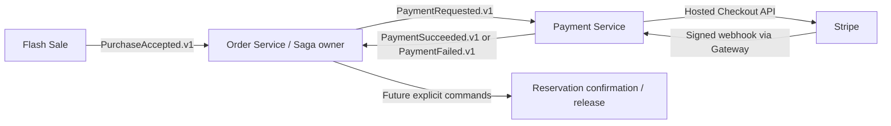

# Implementation Plan: Payment Service MVP with Stripe Checkout

**Branch**: `codex/payment-service-spec` | **Date**: 2026-08-17 | **Spec**: [spec.md](./spec.md)
**Status**: Draft — ready for technical review; implementation is not approved until this plan,
the contracts, the task ledger, and ADR 0018 are accepted.

**Input**: Approved feature specification from `specs/021-payment-service-mvp/spec.md`.

## Summary

Implement Payment Service as the payment participant in an Order-owned Purchase Saga. Order Service
issues an explicit, versioned `PaymentRequested.v1` Kafka command. Payment Service persists its own
payment aggregate, creates a card-only Stripe-hosted Checkout Session, accepts verified Stripe
webhooks through API Gateway, reconciles missing or ambiguous provider outcomes, and publishes
stable `PaymentSucceeded.v1` or `PaymentFailed.v1` facts through an outbox. PostgreSQL is the durable
source of truth; browser redirects and Redis are not part of payment correctness.

The implementation uses package-by-feature with Clean/Hexagonal boundaries. Provider calls occur
outside database transactions. A durable attempt and recovery record is committed before a Stripe
call, and the same provider idempotency key is reused after ambiguous failures. A verified paid
provider state is success-dominant, including when it arrives after a local deadline/failure race;
Payment reports that fact and leaves Saga forward recovery or manual review to Order Service.

## Technical Context

**Language/Version**: Java 21
**Framework**: Spring Boot 3.5.16; Spring Cloud 2025.0.3 at the monorepo edge
**Primary Dependencies**: Spring MVC, Validation, Security/OAuth2 Resource Server, Spring Data JPA,
Spring Kafka, Confluent Avro serializers, Liquibase, Micrometer tracing/observation, Actuator,
Prometheus registry, Stripe Java `33.2.0`, `libs/common-web`, and
`contracts/kafka-avro-contracts`
**Storage**: Service-owned PostgreSQL `payment_db`; no Redis and no access to another service's
database
**Messaging**: Kafka with SpecificRecord Avro, TopicRecordNameStrategy, schema auto-registration
disabled, and BACKWARD_TRANSITIVE compatibility
**Testing**: JUnit 5, Spring Boot Test, Spring Security Test, Spring Kafka Test, Testcontainers
(PostgreSQL/Kafka), ArchUnit, deterministic fake provider tests, bounded Stripe test-mode/CLI smoke,
and load/failure scripts
**Target Platform**: Linux containers; local Docker Compose; Kubernetes Service/DNS in deployed
environments
**Project Type**: Maven monorepo, independently deployable Spring Boot microservice
**Performance Goals**: authenticated query p95 below 200 ms; service-local checkout processing
excluding Stripe time p95 at or below 150 ms; webhook acknowledgement after durable receipt should
remain bounded and independent of downstream processing
**Constraints**: all public traffic through API Gateway; user ownership enforced from trusted JWT;
raw signed webhook body preserved through the edge; durable acceptance before side effects; no card
data, Checkout URL, client secret, webhook secret, authorization header, or raw webhook body in
durable storage/logs/metrics/traces/events
**Scale/Scope**: one Payment per Order, at most three sequential Checkout attempts, one unresolved
attempt at a time, duplicate/out-of-order Kafka and webhook delivery, multiple service replicas,
and crash recovery at every provider/database/event-publication boundary
**Risk Classification**: `CORE_DOMAIN` — money, idempotency, external-provider ambiguity, durable
messaging, and Saga compensation semantics require explicit domain/application boundaries.

## Constitution Check

*GATE: Passed before research and passed again after design.*

| Gate | Result | Design evidence |
|---|---|---|
| Specification traceability | PASS | All behavior traces to the approved spec; no clarification marker remains. |
| Service ownership | PASS | Payment tables, migrations, JPA types, provider adapter, and recovery workers remain in Payment Service. No cross-service database access or shared JPA type is introduced. |
| Communication | PASS | Public HTTP enters through API Gateway; payment initiation/result flow uses the documented Kafka command/facts; no Eureka or undocumented synchronous service call is introduced. |
| Data and messaging | PASS | PostgreSQL is durable truth; command inbox, provider receipt, recovery work, and outbox make duplicate and ambiguous delivery recoverable. Redis is intentionally absent. |
| Root infrastructure ownership | PASS | Shared Compose/Kafka/Schema Registry assets stay under `infra/docker`; service configuration and Liquibase migrations stay under Payment Service. |
| Observability | PASS | Actuator liveness/readiness/Prometheus remain declarative; trace context crosses HTTP/Kafka boundaries; no registry implementation is constructed in business code. |
| Contracts and dependencies | PASS | Five public contracts and one ADR are produced before code. Every new production dependency is justified below. |
| Validation | PASS | Unit, architecture, persistence, Kafka, gateway, provider-failure, webhook, smoke, load, module, and full-reactor checks are defined. |

### Post-design re-check

The design does not add behavior absent from the spec. The business deadline remains canonical even
though Stripe Checkout enforces a longer minimum configurable expiry. The provider Session is
explicitly expired/retrieved by recovery work at the internal deadline. Webhook acknowledgement is
not treated as business completion: only a verified and durably recorded receipt is acknowledged,
then asynchronous processing converges the aggregate.

## Architecture Decisions

### Purchase Saga ownership

[ADR 0018](../../docs/adr/0018-order-owned-purchase-saga-payment-contracts.md) records the accepted
decision: Order Service orchestrates the Purchase Saga; Payment Service is a participant that owns
payment/provider state and emits payment facts. `OrderCreated.v1` remains a fact and is never
reinterpreted as an implicit payment command.



### Payment feature boundary

The payment lifecycle is one aggregate-centered `CORE_DOMAIN` feature. Web, Kafka, scheduled
recovery, persistence, and Stripe are adapters around application ports. Recovery is not split into
a sibling business feature because it applies the same Payment aggregate invariants.

```text
payment/domain
        ▲
payment/application
        ▲
payment/adapter/in/*    payment/adapter/out/*
```

Domain and application packages must not import Spring MVC, JPA, Kafka, Avro, Stripe SDK, or
`common-web` response types. Each boundary owns its own mapper; persistence entities and transport
DTOs never become domain objects.

### Durable Stripe call protocol

Stripe calls must not hold a database transaction or lock open:

1. Transaction A locks the Payment, validates ownership/state/deadline/idempotency/attempt limit,
   creates a durable `CREATING` attempt with a stable provider idempotency key, and schedules
   recovery work.
2. The Stripe adapter creates or retrieves a hosted, card-only Checkout Session outside the
   transaction using that stable key.
3. Transaction B records the provider Session identity and observed state. The authenticated
   response returns the URL with `Cache-Control: no-store` only when an open Session is known.
4. A timeout or broken connection after submission is `UNKNOWN`, not failure. The request returns
   `202 Accepted`; recovery replays the same provider operation key and never creates a second
   attempt blindly.

Client idempotency is global by operation plus a SHA-256 digest of the case-sensitive key. The
record also carries user, Payment, and request fingerprint. Reuse for another Payment/user/request
is `409 PAYMENT_IDEMPOTENCY_CONFLICT`. Replays never create another attempt. Because the Checkout URL
cannot be stored, a replay retrieves it from Stripe by persisted Session ID; an unavailable current
state returns `202` without a URL.

### Webhook and reconciliation protocol

The webhook adapter receives the exact raw bytes and signature header, verifies them with the
configured endpoint secret and bounded timestamp tolerance, extracts only allowlisted identifiers,
and commits a provider-event receipt before returning `204`. It never stores the raw body.

A worker claims receipts, retrieves the current Stripe Session when required, and atomically updates
Payment/Attempt state plus an outbox fact. Duplicate event IDs are no-ops. Concurrent, different
events converge under aggregate locking/version checks. A separate reconciliation worker retrieves
stale/unknown/open Sessions, safely replays ambiguous creation with the original provider key,
expires Sessions at the internal payment deadline, and escalates bounded unrecoverable work to
manual review.

Verified paid state is success-dominant: `SUCCEEDED` cannot regress, and verified late payment may
move a locally failed/expired Payment to `SUCCEEDED`. In that race, a later
`PaymentSucceeded.v1` has a higher aggregate version than any earlier failure fact. Order Service
must perform forward Saga recovery or manual review; Payment Service does not silently refund.

## Dependency Plan

### Production additions to Payment Service

| Dependency | Purpose | Why required |
|---|---|---|
| `libs/common-web` | Repository-standard response/error/trace boundary types | Keeps owner-facing HTTP consistent without leaking web types into application/domain. |
| Spring Validation | Input/header/config validation | Enforces request and configuration contracts at boundaries. |
| Spring Security + OAuth2 Resource Server | JWT authentication and owner identity | Public user APIs require a trusted identity; webhook uses a separate permit rule plus Stripe signature verification. |
| Spring Data JPA + PostgreSQL driver | Durable Payment aggregate and work queues | PostgreSQL is the mandated source of truth. |
| Spring Kafka + Confluent serializers | Versioned command consumption and fact publication | Implements the approved asynchronous Saga contracts. |
| `contracts/kafka-avro-contracts` | Generated SpecificRecord types | Compile-time producer/consumer contract ownership. |
| Micrometer tracing/observation | Trace propagation and safe metrics | Required HTTP/Kafka/provider observability without provider-specific registry coupling. |
| `com.stripe:stripe-java:33.2.0` | Checkout Session create/retrieve/expire and webhook verification | Official Java client, pinned for repeatable builds and API-version review. |

Existing Spring MVC, Actuator, Prometheus runtime registry, and Liquibase dependencies remain.
Stripe is wrapped behind `HostedCheckoutProviderPort`; its SDK types do not cross the adapter.

### Test additions

Spring Security Test, Spring Kafka Test, Testcontainers JUnit/PostgreSQL/Kafka, and ArchUnit validate
boundary behavior. A deterministic fake provider exercises timeouts, duplicate outcomes, and
recovery. Stripe test mode plus Stripe CLI supplies a bounded external smoke test. `stripe-mock` is
not required because it cannot establish the stateful failure/retry behavior this feature depends
on.

### Explicitly not introduced

No Redis, OpenFeign, OAuth2 client credentials, MapStruct, Resilience4j, distributed lock, shared
payment library, global Saga coordinator, or two-phase commit is needed. Provider retries and
recovery are explicit because ambiguous money operations require domain-aware handling.

## Retry, Ordering, and Recovery Policy

| Boundary | Policy |
|---|---|
| `PaymentRequested.v1` | Kafka key `orderId`; idempotent inbox by event ID plus conflict check by order/payload fingerprint; initial attempt plus transient retries at 1s/3s/10s; then `flashsale.payment.payment-requested.dlt.v1`. |
| Stripe create | Stable provider idempotency key per attempt; SDK network retries maximum 2; configurable connect/read timeouts default 5s/20s; any ambiguous outcome becomes durable recovery work. |
| Stripe retrieve/expire | Safe bounded retry with 1s/3s/10s/30s/60s capped backoff; terminal invalid state is reconciled by retrieval, not assumed. |
| Webhook | Unique provider event ID; raw signature verification; persist receipt before `204`; asynchronous idempotent processing. |
| Stale Session | Poll eligible recovery work every 1s in batches of 100 with a 30s lease; periodically retrieve unresolved Sessions and reconcile at the internal deadline. |
| Recovery exhaustion | Create replay is bounded by a 23-hour safe replay window beneath Stripe's minimum idempotency retention; other work has configurable bounded attempts. Exhaustion becomes `MANUAL_REVIEW` with an alert, never a blind new charge. |
| Outbox | Stable event ID and aggregate version; publish indefinitely with capped 60s backoff; mark published only after Kafka acknowledgement. |

Retry counts, timeouts, batches, leases, and backoff are typed configuration with validation and
metrics. Production values can be tuned without changing business semantics.

## Security and PCI-Aware Boundary

- API Gateway authenticates owner APIs, forwards the trusted principal/trace context using existing
  repository conventions, and permits only the exact webhook route without a user JWT.
- Payment Service re-validates JWT trust and ownership; unknown and foreign Payment IDs both return
  the same `404` contract.
- Gateway preserves raw webhook bytes and `Stripe-Signature`; Payment verifies the signature with a
  separately managed endpoint secret and rejects invalid/stale payloads before persistence.
- Stripe secret key, webhook secret, raw webhook body, card data, authorization headers, Checkout
  URL, and provider error bodies are excluded from persistence and telemetry.
- Stripe metadata contains only safe opaque identifiers (`orderId`, `paymentId`, `attemptId`, and
  correlation ID). No user profile or credential data is sent.
- Hosted Checkout narrows card-data handling but does not constitute or claim PCI-DSS compliance.
- Secrets are environment/secret-store inputs, never repository values. Test and production modes
  are explicitly separated, and live-mode webhook events are rejected in a test environment (and
  vice versa).

## Observability

- Actuator exposes liveness, readiness, and Prometheus declaratively.
- Readiness includes database, Kafka/Schema Registry, and configuration validity. Stripe transient
  health does not make the process unready; it is reported through provider/recovery metrics.
- W3C trace context propagates from Gateway and Kafka. Stripe calls receive a correlation context,
  but no credential or Checkout URL enters spans.
- Low-cardinality metrics cover command outcomes, active/unknown payments, checkout create/retrieve
  latency, verified/invalid webhook counts, reconciliation lag, recovery age/attempts, manual-review
  count, outbox lag, and event publication outcomes.
- Logs use safe IDs and result categories only. Provider response/error bodies are classified and
  redacted before logging.

## Project Structure

### Documentation and contracts

```text
specs/021-payment-service-mvp/
├── spec.md
├── plan.md
├── research.md
├── data-model.md
├── quickstart.md
├── contracts/
│   ├── public-payment-http.md
│   ├── stripe-webhook-http.md
│   ├── payment-requested-kafka.md
│   ├── payment-succeeded-kafka.md
│   └── payment-failed-kafka.md
└── tasks.md                    # generated later by speckit-tasks

docs/adr/
└── 0018-order-owned-purchase-saga-payment-contracts.md
```

### Production and validation targets

```text
contracts/kafka-avro-contracts/src/main/avro/topics/
├── flashsale.payment.commands.v1/PaymentRequestedV1.avsc
└── flashsale.payment.events.v1/
    ├── PaymentSucceededV1.avsc
    └── PaymentFailedV1.avsc

services/payment-service/src/main/java/com/philia/flashsale/payment/
├── payment/
│   ├── domain/
│   │   ├── model/
│   │   ├── policy/
│   │   └── exception/
│   ├── application/
│   │   ├── port/in/
│   │   ├── port/out/
│   │   ├── service/
│   │   └── model/
│   └── adapter/
│       ├── in/
│       │   ├── web/
│       │   ├── webhook/
│       │   ├── messaging/kafka/
│       │   └── scheduling/
│       └── out/
│           ├── persistence/jpa/
│           ├── provider/stripe/
│           └── messaging/kafka/
├── outbox/
├── configuration/
├── security/
├── observability/
└── websupport/

services/payment-service/src/main/resources/
├── application.yml
└── db/changelog/

services/payment-service/src/test/java/com/philia/flashsale/payment/
├── payment/domain/
├── payment/application/
├── payment/adapter/
├── architecture/
├── contract/
└── integration/

services/api-gateway/
├── src/main/resources/application.yml
└── src/test/java/com/philia/flashsale/gateway/

infra/docker/
├── compose.yml
├── compose.dev.yml
├── .env.example
├── kafka/init-payment-topics.sh
├── schema-registry/register-payment-schemas.ps1
└── smoke/feature-021-payment.ps1

load-tests/payment-service/
└── feature-021-payment.js
```

**Structure Decision**: retain the independently deployable Payment Service module and implement one
aggregate-centered package-by-feature slice. Shared Avro schemas remain in the existing contract
module; shared local infrastructure remains in `infra/docker`; Gateway owns edge routing/security.
No business model, JPA entity, provider DTO, or repository is shared.

## Contract Impact

| Surface | Change |
|---|---|
| API Gateway | Add authenticated routes for `/api/v1/payments/**`; add exact unauthenticated pass-through for `/webhooks/v1/payments/stripe`; preserve raw body/signature and trace behavior. |
| Order Service | Future implementation produces `PaymentRequested.v1` and consumes Payment result facts. Feature 021 defines contracts but must not silently activate incomplete Order Saga behavior. |
| Contract module | Add three Avro v1 records and schema compatibility tests. |
| Kafka infrastructure | Add command, event, and command-DLT topics with local partitions/replication specified in the contracts. |
| Payment HTTP | Add two owner queries, one idempotent Checkout creation/resume endpoint, and one Stripe webhook endpoint. |

## Implementation Sequence

`speckit-tasks` must convert this into dependency-ordered, independently verifiable groups. The
expected order is:

1. Contract schemas, compatibility tests, topic provisioning, and Gateway route/security tests.
2. Domain model and pure invariant tests.
3. Liquibase model, JPA adapters, locking/idempotency/outbox integration tests.
4. `PaymentRequested.v1` consumer with inbox semantics and DLT tests.
5. Stripe port/adapter, durable Checkout orchestration, owner HTTP APIs, and redaction tests.
6. Webhook receipt/verification/processing and duplicate/out-of-order tests.
7. Reconciliation, deadline expiry, ambiguous outcome recovery, and manual-review alerts.
8. Outbox publisher, Payment facts, Order-facing contract verification, observability, smoke,
   failure matrix, load test, module verify, and full monorepo verify.

No task may mark downstream Order/reservation Saga behavior complete unless its own approved feature
implements and validates that behavior.

## Validation Strategy

| Layer | Required evidence |
|---|---|
| Domain unit | State transitions, success dominance, deadline rules, one unresolved attempt, three-attempt limit, amount/currency invariants. |
| Application unit | Command idempotency/conflict, owner masking, replay behavior, ambiguous provider outcomes, recovery scheduling, stable fact identity. |
| Architecture | ArchUnit verifies domain/application dependency direction and adapter isolation. |
| Persistence integration | PostgreSQL/Testcontainers verifies unique/partial indexes, pessimistic claims, concurrent attempts, inbox/outbox atomicity, and crash-safe leases. |
| Kafka contract/integration | Avro evolution, record strategy, key/order, duplicate/conflict handling, retry/DLT, headers, and stable outbox replay. |
| HTTP/security contract | `ApiResponse`/`ApiErrorResponse`, status/error mapping, no-store, ownership masking, trace header, Gateway authentication, exact webhook bypass, and raw body/signature preservation. |
| Provider adapter | Request mapping, VND exact conversion, metadata allowlist, timeouts, stable provider key, retrieve/expire behavior, exception classification, and telemetry redaction. |
| Failure matrix | Database loss, Stripe response loss, duplicate/out-of-order webhook, crash after each durable boundary, Kafka/Schema Registry outage, deadline/expire race, and late success. |
| Smoke/load | Bounded Stripe test-mode happy path plus gradually increasing owner-query/checkout orchestration load; thresholds distinguish service-local time from external provider time. |
| Build | `./mvnw -pl services/payment-service -am verify`, affected Gateway/contract builds, then `./mvnw clean verify`. |

Implementation evidence will be recorded in a future
`specs/021-payment-service-mvp/validation.md` with commands, scope, exit status, and CI/PR links.

## Complexity Tracking

No constitution violation requires an exception. The extra durable tables and workers are direct
consequences of money-operation idempotency, provider ambiguity, webhook delivery semantics, and
outbox reliability; they stay inside a single service and aggregate boundary.

## Planning Outputs

- [research.md](./research.md): resolved provider, idempotency, webhook, money, retry, and testing
  decisions with primary sources.
- [data-model.md](./data-model.md): aggregate, state machines, tables, constraints, and transaction
  boundaries.
- [contracts](./contracts): public HTTP and versioned Kafka contracts.
- [quickstart.md](./quickstart.md): local validation and evidence workflow.
- [ADR 0018](../../docs/adr/0018-order-owned-purchase-saga-payment-contracts.md): accepted Saga
  ownership and Payment command/fact decision.

The next gated step is human review/approval of these artifacts, followed by `speckit-tasks`. No
production implementation is authorized by this draft alone.
